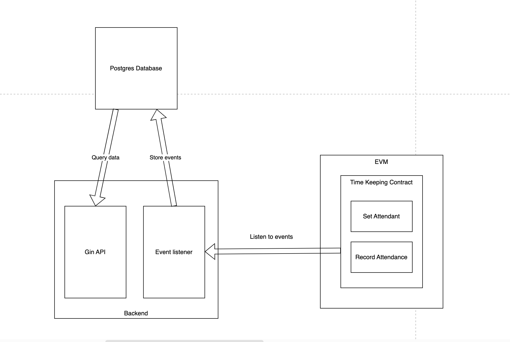
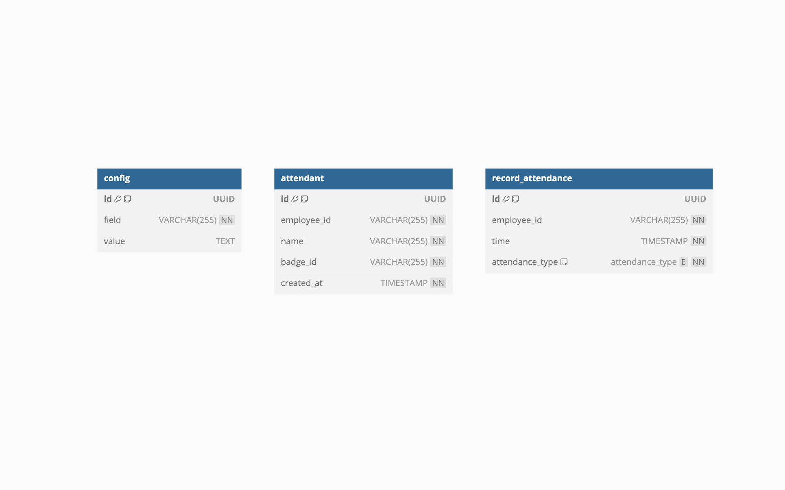

# Documentation: Attendance Management System
This document outlines the architecture, deployment instructions, API details, and data schema for the attendance management system.

[Smart contract repository](https://github.com/huynhdongduong8991/timekeeping-smartcontract)

## Solution architecture
The system follows a Model-View-Controller (MVC) architecture on the backend.
### Backend
- Uses go-ethereum to listen for events emitted by the smart contract.
- Implements a separate job to retrieve all events from the smart contract, ignoring duplicates already stored in the database.
- Stores attendance events in a Postgres database.
- Leverages Infura for RPC and WebSocket URLs.
- Uses Gin for building the API.
### Smart Contract
- Developed using Hardhat.
- Adheres to a standard smart contract structure.
- Implements timekeeping functionality for recording attendance events.
- Includes unit tests for thorough validation.



## Instruction to deploy smart contract to Sepolia testnet
1. Clone the source code from the GitHub repository.
2. Within the Hardhat project directory, execute ```npm install``` to install dependencies.
3. Run unit tests with ```npx hardhat test```. Ensure all tests pass before deployment.
4. Deploy the contract to the Sepolia testnet using the following command:
```npx hardhat ignition deploy ./ignition/modules/TimeKeeping.js --network sepolia```

## API endpoints
- getAttendantById:
    - Method: GET
    - URL: ```http://localhost:3000/attendants/:employeeId```
    - Example request: ```http://localhost:3000/attendants/0xA371A2804CBBa83de8069E3c59CB7a307EB17b71```
    - Example response:
    ```JSON
    {
        "id": "4e99d6d3-620b-426a-89ee-f746a571571f",
        "employeeId": "0xA371A2804CBBa83de8069E3c59CB7a307EB17b71",
        "name": "john doe",
        "createdAt": "2024-05-18T16:15:12Z",
        "badgeId": "A001"
    }
    ```
- getAttendantRecordAttendances:
    - Method: GET
    - URL: ```http://localhost:3000/attendants/:employeeId/record-attendances```
    - Example request: ```http://localhost:3000/attendants/0xA371A2804CBBa83de8069E3c59CB7a307EB17b71/record-attendances```
    - Example response:
    ```JSON
    [
        {
            "id": "0fcf2286-1bd1-421c-8d99-9fa23491c8f7",
            "employeeId": "0xA371A2804CBBa83de8069E3c59CB7a307EB17b71",
            "time": "2024-05-18T16:16:12Z",
            "attendanceType": "CHECKIN"
        },
        {
            "id": "b93d1bdc-a11f-4fb7-9435-27628dfac65e",
            "employeeId": "0xA371A2804CBBa83de8069E3c59CB7a307EB17b71",
            "time": "2024-05-18T16:16:36Z",
            "attendanceType": "CHECKOUT"
        }
    ]
    ```

## Schema explaination
```SQL
CREATE EXTENSION IF NOT EXISTS "uuid-ossp";
CREATE TYPE attendance_type AS ENUM ('CHECKIN', 'CHECKOUT');

CREATE TABLE config (
    id UUID PRIMARY KEY DEFAULT uuid_generate_v4(),
    field VARCHAR(255) NOT NULL UNIQUE,
    value TEXT
)

CREATE TABLE attendant (
    id UUID PRIMARY KEY DEFAULT uuid_generate_v4(),
    employee_id VARCHAR(255) NOT NULL,
    name VARCHAR(255) NOT NULL,
    badge_id VARCHAR(255) NOT NULL,
    created_at TIMESTAMP NOT NULL
);

CREATE TABLE record_attendance (
    id UUID PRIMARY KEY DEFAULT uuid_generate_v4(),
    employee_id VARCHAR(255) NOT NULL,
    time TIMESTAMP NOT NULL,
    attendance_type attendance_type NOT NULL
);
```

The system utilizes a Postgres database with the following tables:
- config: Stores configuration data for the application (key-value pairs).
    - **id (UUID)**: Primary key for the table.
    - **field (VARCHAR(255))**: Unique identifier for the configuration setting.
    - **value (TEXT)**: The actual value associated with the configuration field.
- attendant: Stores employee information.
    - **id (UUID)**: Primary key for the table.
    - **employee_id (VARCHAR(255))**: Unique identifier for the employee (likely an Ethereum address).
    - **name (VARCHAR(255))**: Employee's name.
    - **badge_id (VARCHAR(255))**: Employee's badge ID.
    - **created_at (TIMESTAMP)**: Timestamp of when the employee record was created.
- record_attendance: Stores attendance record.
    - **id (UUID)**: Primary key for the table.
    - **employee_id (VARCHAR(255))**: Foreign key referencing the attendant table.
    - **time (TIMESTAMP)**: Timestamp of the attendance event.
    - **attendance_type (attendance_type)**: Type of attendance event (CHECKIN or CHECKOUT).
